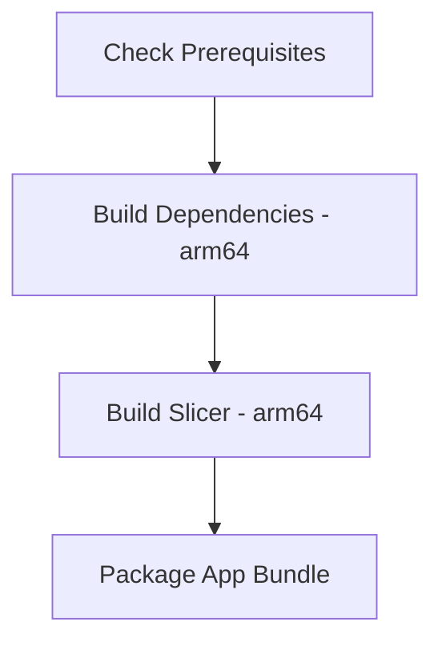

# OrcaSlicer macOS Build Plan (Apple Silicon)

## Build Strategy for Slow Computers

Given your Apple Silicon Mac and slow build times, here's the recommended approach:

### Build Command Options

```bash
# Recommended for slow computers - single-threaded deps build (much slower but uses less memory)
./build_release_macos.sh -a arm64 -1 -d

# Then build slicer (can use more parallelism for this)
./build_release_macos.sh -a arm64 -1 -s
```

### Build Script Options Explained

| Flag | Description | Use for Slow Computers |
|------|-------------|----------------------|
| `-a arm64` | Target Apple Silicon | Required for M1/M2/M3 |
| `-1` | Single job/thread | **Recommended** - reduces memory pressure |
| `-x` | Use Ninja instead of Xcode | Faster builds, better for incremental |
| `-d` | Build deps only | First step |
| `-s` | Build slicer only | Second step |
| `-b` | Build without reconfiguring | Skip CMake reconfigure |
| `-c Release` | Release build | Default, do not change |

### Build Order



## Build Process

1. **Dependencies**: `build/deps/arm64/OrcaSlicer_dep` - Contains compiled libraries (boost, wxWidgets, etc.)
2. **Slicer**: `build/arm64/src/OrcaSlicer.app` - The main application bundle
3. **Final**: `build/arm64/OrcaSlicer/OrcaSlicer.app` - Repackaged with resources

## Important Notes

- The `-1` flag limits each build step to a single job, reducing memory usage significantly
- The deps build typically takes the longest - this is where patience is needed
- Build output: `build/arm64/OrcaSlicer/OrcaSlicer.app`
- To rebuild after changes, use `-b` flag to skip CMake reconfiguration
