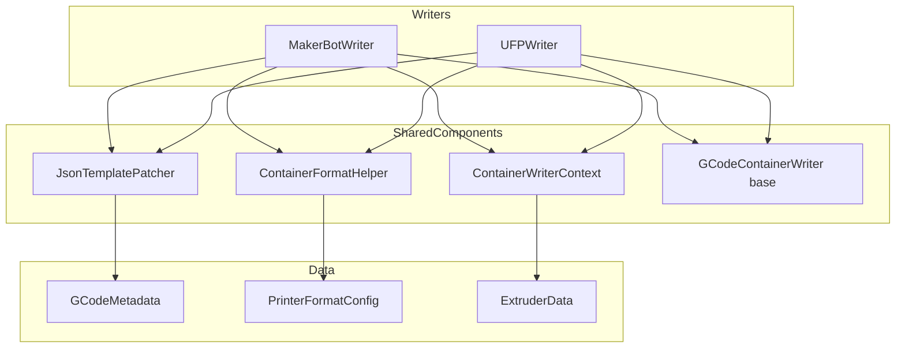

# Container Format Writers - Refactoring Opportunities

## Executive Summary

After reviewing `ContainerWriterContext`, `MakerBotWriter`, and `UFPWriter`, I've identified several areas for improvement including API inconsistencies, dead code, duplicated patterns, and missing functionality that was lost during the previous refactoring.

---

## 1. ContainerWriterContext Improvements

### Current Issues

| Issue | Location | Problem |
|-------|----------|---------|
| Inconsistent semantics | `set_thumbnail()` vs `set_thumbnails()` | One appends, one replaces - confusing API |
| Missing validation | No validation methods | No way to check data consistency before export |
| Missing clear/reset | No `clear()` method | Cannot reset state between exports without destroying object |
| Missing accessor | No non-const `get_extruder_data(idx)` | Cannot modify extruder data after setting |
| Missing propagation | No dual-extruder helper | Lost functionality: propagating extruder 0 data to extruder 1 |

### Recommended Changes

```cpp
// Add to ContainerWriterContext.hpp

// Reset all state for reuse between exports
void clear();

// Validate that required data is present
bool validate_for_export(std::string& error_out) const;

// Get mutable access to specific extruder
ExtruderData& get_extruder_data(int idx);

// Propagate extruder 0 data to extruder 1 if extruder 1 is empty
// (restores functionality lost from UFPWriter)
void propagate_extruder_data_if_needed();

// Fix semantics: rename for clarity
void add_thumbnail(const std::vector<uint8_t>& data, const std::string& filename);  // was set_thumbnail
```

---

## 2. MakerBotWriter Issues

### Dead Code / Redundancy

| Location | Issue | Action |
|----------|-------|--------|
| `has_thumbnail_data()` | Uses base class method, not context | Remove - use `m_context.has_thumbnails()` |
| `m_thumbnail_data` | Base class member, not used | Verify if still needed or remove |
| `write_container()` lines 174-202 | Backward compatibility branch for single thumbnail | Dead code - context always has thumbnails |

### Deduplication Opportunities

1. **Template Loading** (lines 301-324): Same pattern as UFPWriter
   - Extract to `ContainerFormatHelper::load_template_file()`

2. **JSON Patching** (lines 332-376): Similar to UFPWriter's slicemetadata patching
   - Create shared `JsonTemplatePatcher` utility

3. **Material Name Mapping** (`material_name_to_code()`):
   - Move to `FormatConfig` or `ContainerFormatHelper` for reuse

### Lost Functionality

The previous implementation had dual-extruder GUID propagation that was removed:
```cpp
// OLD CODE (removed):
if (!m_extruders[1].material_guid.empty()) {
    // Extruder 1 has its own GUID
} else if (!m_extruders[0].material_guid.empty()) {
    // Propagate GUID from extruder 0 for dual extrusion with same material
    m_extruders[1].material_guid = m_extruders[0].material_guid;
}
```

**Impact:** Dual-extruder MakerBot exports may have empty GUIDs for extruder 1.

---

## 3. UFPWriter Issues

### Dead Code / Redundancy

| Location | Issue | Action |
|----------|-------|--------|
| `has_thumbnail_data()` | Uses base class method | Should use `m_context.has_thumbnails()` |
| `m_thumbnail_data` | Base class member | Verify if still needed |
| `write_container()` lines 100-112 | Uses base class thumbnail | Should use context thumbnails |

### Deduplication Opportunities

1. **Template Loading** (lines 409-427): Identical pattern to MakerBotWriter
   - Share via `ContainerFormatHelper`

2. **Nozzle Variant Loading** (`load_nozzle_variants()`):
   - Could be shared if MakerBot adds nozzle variant support

3. **JSON Patching** (lines 434-487): Same pattern as MakerBotWriter
   - Share via `JsonTemplatePatcher`

### Lost Functionality

Dual-extruder GUID propagation was removed from `override_metadata()`:
```cpp
// OLD CODE (removed):
// Handle extruder 1: similar logic but also check extruder 0 for propagation
if (!m_extruders[1].material_guid.empty()) {
    // Extruder 1 has its own GUID
} else if (!m_extruders[0].material_guid.empty()) {
    // Propagate GUID from extruder 0 for dual extrusion with same material
    m_extruders[1].material_guid = m_extruders[0].material_guid;
}
```

**Impact:** Dual-extruder UFP exports may have empty GUIDs for extruder 1.

---

## 4. Shared Patterns for Extraction

### Pattern 1: Template File Loading

Both writers use identical template loading logic:

```cpp
// Extract to ContainerFormatHelper:
static std::string load_template_file(
    const std::string& format_type,
    const std::string& template_filename,
    const std::vector<std::string>& fallback_paths = {}
);
```

### Pattern 2: JSON Template Patching

Both patch JSON templates with metadata values:

```cpp
// New utility class:
class JsonTemplatePatcher {
public:
    static std::string patch_slicemetadata(
        const std::string& template_json,
        const GCodeMetadata& meta,
        const PrinterFormatConfig& config
    );
};
```

### Pattern 3: Thumbnail Handling

Both writers handle thumbnails but with different ZIP paths:

```cpp
// ContainerWriterContext already supports multiple thumbnails
// Just need to ensure both writers use it consistently
```

---

## 5. Recommended Refactoring Plan

### Phase 1: ContainerWriterContext Improvements

1. Add `clear()` method
2. Add `validate_for_export()` method
3. Add `propagate_extruder_data_if_needed()` method
4. Rename `set_thumbnail()` to `add_thumbnail()` for clarity
5. Add non-const `get_extruder_data(idx)` accessor

### Phase 2: Remove Dead Code

1. Remove backward compatibility thumbnail handling from MakerBotWriter
2. Update UFPWriter to use context thumbnails exclusively
3. Verify and remove unused base class members if appropriate

### Phase 3: Extract Shared Utilities

1. Create `ContainerFormatHelper::load_template_file()`
2. Create `JsonTemplatePatcher` utility class
3. Move `material_name_to_code()` to shared location

### Phase 4: Restore Lost Functionality

1. Add dual-extruder GUID propagation to `ContainerWriterContext`
2. Ensure both writers benefit from propagation logic

---

## 6. Architecture Diagram



---

## 7. Priority Matrix

| Issue | Impact | Effort | Priority |
|-------|--------|--------|----------|
| Restore dual-extruder GUID propagation | High | Low | **Critical** |
| Fix thumbnail handling consistency | Medium | Low | High |
| Add ContainerWriterContext::clear() | Low | Low | Medium |
| Extract template loading | Medium | Medium | Medium |
| Extract JSON patching | Medium | Medium | Medium |
| Remove dead code | Low | Low | Low |

---

## 8. Files to Modify

1. `src/libslic3r/Format/ContainerWriterContext.hpp` - Add new methods
2. `src/libslic3r/Format/ContainerWriterContext.cpp` - Implement new methods
3. `src/libslic3r/Format/MakerBotWriter.cpp` - Remove dead code, use context
4. `src/libslic3r/Format/UFPWriter.cpp` - Remove dead code, use context
5. `src/libslic3r/Format/ContainerFormatHelper.hpp` - Add template loading
6. `src/libslic3r/Format/ContainerFormatHelper.cpp` - Implement template loading
7. (Optional) Create `src/libslic3r/Format/JsonTemplatePatcher.hpp/cpp`

---

*Generated: 2026-03-31*
*Review of: ContainerWriterContext, MakerBotWriter, UFPWriter*
