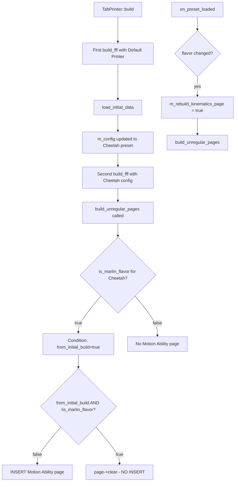

# Debug Plan: Motion Ability Tab Missing for Cheetah Firmware

## Problem Summary
When firmware flavor is set to "Cheetah", the Motion Ability tab (kinematics page) is not showing. Previous fixes resolved glitchy behavior but not the core issue.

## What We Know
1. **Cheetah IS included** in all `is_marlin_flavor` checks in Tab.cpp:
   - Line 4801: `build_unregular_pages()` check
   - Line 5113: `on_preset_loaded()` check
   - Line 5449: `update_fff()` check

2. **Key variables involved**:
   - `m_last_is_marlin_flavor` - tracks previous flavor state (initialized to `false`)
   - `m_rebuild_kinematics_page` - flag to trigger page rebuild
   - `from_initial_build` - parameter passed during initialization

3. **Key functions**:
   - `build_unregular_pages()` - adds/removes Motion Ability page
   - `on_preset_loaded()` - called after preset load
   - `update_fff()` - updates FFF settings

## Debug Logging Strategy

Add `BOOST_LOG_TRIVIAL(warning)` statements to trace:

### Location 1: build_unregular_pages() - Line ~4800
```cpp
// After flavor check
BOOST_LOG_TRIVIAL(warning) << "build_unregular_pages: flavor=" << flavor 
    << ", is_marlin_flavor=" << is_marlin_flavor 
    << ", from_initial_build=" << from_initial_build;
```

### Location 2: Page existence check - Line ~4810
```cpp
// After checking for existing Motion Ability page
BOOST_LOG_TRIVIAL(warning) << "build_unregular_pages: existed_page=" << existed_page 
    << ", n_before_extruders=" << n_before_extruders;
```

### Location 3: Page insertion decision - Line ~4820
```cpp
// Before inserting/clearing page
BOOST_LOG_TRIVIAL(warning) << "build_unregular_pages: condition met=" << (existed_page < n_before_extruders && (is_marlin_flavor || from_initial_build))
    << ", will_insert=" << !(from_initial_build && !is_marlin_flavor);
```

### Location 4: on_preset_loaded() - Line ~5114
```cpp
// After flavor comparison
BOOST_LOG_TRIVIAL(warning) << "on_preset_loaded: flavor=" << flavor 
    << ", is_marlin_flavor=" << is_marlin_flavor 
    << ", m_last_is_marlin_flavor=" << m_last_is_marlin_flavor
    << ", m_rebuild_kinematics_page=" << m_rebuild_kinematics_page;
```

### Location 5: update_fff() - Line ~5450
```cpp
// After flavor comparison
BOOST_LOG_TRIVIAL(warning) << "update_fff: is_marlin_flavor=" << is_marlin_flavor 
    << ", m_last_is_marlin_flavor=" << m_last_is_marlin_flavor
    << ", m_rebuild_kinematics_page=" << m_rebuild_kinematics_page;
```

### Location 6: TabPrinter constructor - Line ~4343
```cpp
// During initialization
BOOST_LOG_TRIVIAL(warning) << "TabPrinter::build: initial build starting";
// And after load_initial_data
BOOST_LOG_TRIVIAL(warning) << "TabPrinter::build: after load_initial_data, calling build_fff";
```

## Expected Output Analysis

When running with Cheetah preset, we should see:
1. Initial build sequence with flavor values
2. Whether `is_marlin_flavor` evaluates correctly for Cheetah
3. Whether page insertion conditions are met
4. Whether `m_last_is_marlin_flavor` state tracking works correctly

## Questions to Answer

1. Is `is_marlin_flavor` evaluating to `true` when flavor is Cheetah?
2. Is `build_unregular_pages()` being called at the right time?
3. Is `from_initial_build` affecting the page insertion logic?
4. Is `m_last_is_marlin_flavor` being set correctly during initialization?

## Implementation Steps

1. Add debug logging to Tab.cpp at the 6 locations identified above
2. Build OrcaSlicer in Debug or RelWithDebInfo mode
3. Run OrcaSlicer with a Cheetah firmware preset
4. Check log output (console or log file)
5. Analyze the output to identify where the logic breaks down
6. Implement fix based on findings
7. Remove debug logging (or convert to trace level) after fix is confirmed

## Diagram: Expected Flow for Cheetah Preset


