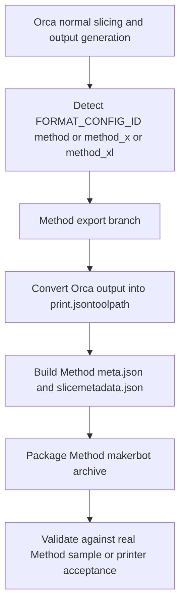

# Method Family `.makerbot` Export Plan

## Goal

Add support in OrcaSlicer for exporting UltiMaker Method-family jobs as `.makerbot` packages by extending the existing MakerBot container export stack with:

- Method-specific package payload generation
- Method-specific `meta.json` / `slicemetadata.json` handling
- dual-extruder metadata support
- printer/profile/config wiring for the Method family

The key correction from the earlier draft is that Method-family export is not just another Sketch-style `.makerbot` package. Cura writes a different internal payload for Method printers.

> Status note:
> historical investigation details are intentionally retained below, but they predate the current local implementation work.
> When an older bullet conflicts with the newer "Current local implementation status" section, the current local status wins.

> Status refresh (2026-04-17):
> `HEAD` now has a local follow-up commit beyond `origin/main`.
> That local follow-up is a profile/resource/documentation pass that adds explicit dual `0.4` `nozzle_diameter` arrays to the shipped Method machine presets, restores missing Method setup-wizard cover art, and keeps Method's required `thumbnail_960x1460.png` only in the MakerBot format configs.
> Troubleshooting on 2026-04-17 confirmed that putting `960x1460` into the printer preset `thumbnails` field breaks Orca's preset thumbnail validation because dimensions `>= 1000` are rejected during config load, which can take down the whole UltiMaker vendor bundle.

The scope should now explicitly cover:

- Method shared conversion behavior
- Method X shared conversion behavior
- Method XL-specific differences in config, metadata, machine geometry, and any payload deltas

There is also a routing distinction to keep explicit:

- Cura supports plain Method, Method X, and Method XL as separate machines
- local `HEAD` now routes all three through `FORMAT_CONFIG_ID:method`, `method_x`, and `method_xl`
- the remaining routing work is no longer "does plain Method exist", but "are the shipped presets, variants, and tuned defaults complete enough to expose the whole family safely"

## What was verified from [`../Cura-main`](../Cura-main)

- Cura uses the shared text G-code pipeline first:
  - CuraEngine produces G-code
  - Cura stores it in [`scene.gcode_dict`](../Cura-main/plugins/CuraEngineBackend/CuraEngineBackend.py:914)
  - [`GCodeWriter.write()`](../Cura-main/plugins/GCodeWriter/GCodeWriter.py:59) emits the normal text G-code
- Cura's normal user-facing post-processing scripts run on `scene.gcode_dict` before file export starts:
  - [`PostProcessingPlugin` hooks `writeStarted`](../Cura-main/plugins/PostProcessingPlugin/PostProcessingPlugin.py:51)
  - scripts mutate the active build plate's G-code list in [`execute()`](../Cura-main/plugins/PostProcessingPlugin/PostProcessingPlugin.py:71)
- Cura then branches inside [`MakerbotWriter.write()`](../Cura-main/plugins/MakerbotWriter/MakerbotWriter.py:94) based on mime type:
  - Sketch uses [`print.gcode`](../Cura-main/plugins/MakerbotWriter/MakerbotWriter.py:120)
  - Method uses [`print.jsontoolpath`](../Cura-main/plugins/MakerbotWriter/MakerbotWriter.py:122)
  - Replicator+ also uses `print.jsontoolpath`
- After that, `MakerbotWriter` fetches the final text G-code through [`GCodeWriter`](../Cura-main/plugins/MakerbotWriter/MakerbotWriter.py:112) and converts it into Method payload format through [`du.gcode_2_miracle_jtp(...)`](../Cura-main/plugins/MakerbotWriter/MakerbotWriter.py:123)
- The Method conversion is not implemented as a normal Cura post-processing script. It is a dedicated export-time conversion inside `MakerbotWriter`, backed by the external `pyDulcificum` / `dulcificum` dependency:
  - [`import pyDulcificum as du`](../Cura-main/plugins/MakerbotWriter/MakerbotWriter.py:7)
  - [`dulcificum/5.10.0`](../Cura-main/conandata.yml:9)
  - [`pyDulcificum` hidden import](../Cura-main/conandata.yml:101)
- Cura identifies Method printers through machine definitions and printer-id mapping, not a separate exporter:
  - [`fire_e -> ultimaker_method`](../Cura-main/cura/PrinterOutput/FormatMaps.py:13)
  - [`lava_f -> ultimaker_methodx`](../Cura-main/cura/PrinterOutput/FormatMaps.py:14)
  - [`magma_10 -> ultimaker_methodxl`](../Cura-main/cura/PrinterOutput/FormatMaps.py:15)
- Cura machine definitions confirm Method X and Method XL use [`application/x-makerbot`](../Cura-main/resources/definitions/ultimaker_methodx.def.json:10) and are dual-extruder machines:
  - [`ultimaker_methodx.def.json`](../Cura-main/resources/definitions/ultimaker_methodx.def.json:53)
  - [`ultimaker_methodxl.def.json`](../Cura-main/resources/definitions/ultimaker_methodxl.def.json:55)
- Cura's Method metadata path is richer than the current Orca Sketch path:
  - includes arrays for materials, temperatures, and tool types
  - includes Method-only fields like bounding box and acceleration overrides in [`_getMeta()`](../Cura-main/plugins/MakerbotWriter/MakerbotWriter.py:179)
- Cura's hidden converter is fed from Cura's normal exported G-code, but Method-family machine definitions still matter:
  - [`ultimaker_method_base.def.json` sets `machine_gcode_flavor` to `Griffin`](../Cura-main/resources/definitions/ultimaker_method_base.def.json)
  - this means Orca must validate not just "can we translate text G-code", but "can we translate the right source semantics closely enough"

## What was verified from the parent reference folders

- There is no separate Method-family Python postprocessor in [`../postprocessors`](../postprocessors)
- The only local MakerBot postprocessor references are Sketch-oriented helpers:
  - [`makerbot_sketch_small.py`](../postprocessors/makerbot_sketch_small.py)
  - [`makerbot_sketch_sprint.py`](../postprocessors/makerbot_sketch_sprint.py)
- That reinforces the Cura source finding: Method conversion is not implemented as a normal postprocessing script layer in the local references we have

## Guidance from [`AGENTS_JATMN.md`](../AGENTS_JATMN.md)

- `method_x` and `method_xl` are already reserved in Orca's `FORMAT_CONFIG_ID` system, but their config files were intentionally removed and must be restored only as part of real implementation work:
  - [`method_x` reserved in code](../AGENTS_JATMN.md#L187)
  - [`method_xl` reserved in code](../AGENTS_JATMN.md#L188)
  - [no fallback if config is missing](../AGENTS_JATMN.md#L197)
- The repo guidance explicitly says Method and Method XL are still placeholder-only and that Cura's Method behavior still needs to be ported into `MakerBotWriter`:
  - [Method / Method X placeholder note](../AGENTS_JATMN.md#L490)
  - [Method XL placeholder note](../AGENTS_JATMN.md#L491)
- The guide also marks the parent reference directories as the authoritative references for this work:
  - [`../Cura-main`](../AGENTS_JATMN.md#L504)
  - [`../Cura files`](../AGENTS_JATMN.md#L505)
  - [`../postprocessors`](../AGENTS_JATMN.md#L506)
  - [`../Info`](../AGENTS_JATMN.md#L507)
- Any implementation must remain native in OrcaSlicer with zero dependency on the Python reference scripts:
  - [reference-only Python note](../AGENTS_JATMN.md#L506)

## What was verified from OrcaSlicer

- Orca already reserves Method IDs in format routing:
  - local `HEAD` now routes [`method`, `method_x`, and `method_xl` through `makerbot`](../src/libslic3r/Format/FormatConfig.cpp#L243)
- Orca already reserves Method mime handling for upload:
  - local `HEAD` now uses [`application/x-makerbot` for `method`, `method_x`, and `method_xl`](../src/slic3r/Utils/UltiMaker.cpp#L497)
- local `HEAD` now ships Method config entries in [`resources/formats/makerbot/manifest.json`](../resources/formats/makerbot/manifest.json)
- Orca's MakerBot writer now has a Method-family branch locally:
  - Sketch still writes [`print.gcode`](../src/libslic3r/Format/MakerBotWriter.cpp#L129)
  - Method-family now writes `print.jsontoolpath` plus Method-shaped `meta.json` / `slicemetadata.json`
  - the Method branch already maps native printer / tool / material ids and emits per-extruder metadata, but still needs broader runtime and printer acceptance validation
- Orca's existing UFP path is a useful cross-reference for firmware-facing material identity handling:
  - [`BackgroundSlicingProcess` extracts `printer_extruder_variant` from the active full config](../src/slic3r/GUI/BackgroundSlicingProcess.cpp#L997)
  - [`BackgroundSlicingProcess` resolves filament GUIDs by walking preset inheritance and reading `MATERIAL_GUID:` from `filament_notes`](../src/slic3r/GUI/BackgroundSlicingProcess.cpp#L75)
  - [`BackgroundSlicingProcess` injects per-extruder `material_guid`, `brand`, `material_name`, and `extruder_temp` into export data](../src/slic3r/GUI/BackgroundSlicingProcess.cpp#L1243)
  - [`UFPWriter::override_metadata()` explicitly prefers injected extruder GUID / material name over parsed G-code metadata](../src/libslic3r/Format/UFPWriter.cpp#L167)
  - [`UFPWriter::generate_extruder_block()` writes firmware-facing material GUID / volume / temperature header lines](../src/libslic3r/Format/UFPWriter.cpp#L284)
  - [`UFPWriter::generate_slicemetadata_json()` patches `material_guid`, `material_type`, temperatures, and machine name into the JSON payload](../src/libslic3r/Format/UFPWriter.cpp#L366)
  - [`UFPWriter::generate_material_xml()` writes brand, material name, and GUID from injected preset-backed data](../src/libslic3r/Format/UFPWriter.cpp#L456)

## UltiMaker preset / UI cross-reference inside Orca

- Orca's current UltiMaker profile architecture already separates machine/tool, process, and material identity concerns:
  - machine presets carry the active hardware variant selection and default profile wiring
  - process presets select defaults based on printer family + active hardware variant
  - filament presets carry manufacturer material identity such as firmware GUIDs
- Example machine wiring from Orca's shipped UltiMaker S6 preset:
  - [`default_print_profile` points to a core-specific process preset](../resources/profiles/UltiMaker/machine/UltiMaker%20S6%200.4%20nozzle.json#L10)
  - [`printer_extruder_variant` stores the active core/tool selection per extruder](../resources/profiles/UltiMaker/machine/UltiMaker%20S6%200.4%20nozzle.json#L15)
  - [`default_filament_profile` points to the default material preset per extruder](../resources/profiles/UltiMaker/machine/UltiMaker%20S6%200.4%20nozzle.json#L30)
- Example process wiring from Orca's shipped UltiMaker S6/S8 preset:
  - [`compatible_printers_condition` keys process compatibility on both nozzle size and `printer_extruder_variant_0`](../resources/profiles/UltiMaker/process/0.20mm%20Standard%20@UltiMaker%20S6-S8%20AA%2B%200.4.json#L8)
- Example filament/material identity wiring from Orca's shipped UltiMaker filament presets:
  - [`@base` carries the real `MATERIAL_GUID:` in `filament_notes`](../resources/profiles/OrcaFilamentLibrary/filament/UltiMaker/UltiMaker%20Tough%20PLA%20@base.json#L23)
  - [`@System` is the instanced filament preset layer used by machines/processes](../resources/profiles/OrcaFilamentLibrary/filament/UltiMaker/UltiMaker%20Tough%20PLA%20@System.json#L1)
- Orca's Prepare-tab UltiMaker work also already links UI variant choice to process selection:
  - [`ExtruderVariantWidget` is the dedicated Prepare widget for swappable cores](../src/slic3r/GUI/ExtruderVariantWidget.cpp#L38)
  - it shows the user-facing ["Print Core Configuration" panel](../src/slic3r/GUI/ExtruderVariantWidget.cpp#L44)
  - it now uses only [`UltiMaker` and `Method` matrix modes detected from `printer_notes` tags such as `PROCESS_MATRIX_TYPE:*`](../src/slic3r/GUI/ExtruderVariantWidget.cpp#L50)
  - it now derives available core / extruder options from visible process preset [`compatible_printers_condition`](../src/slic3r/GUI/ExtruderVariantWidget.cpp#L241) rules instead of hard-coded printer-model lists
  - it now reads the process-driving slot from preset data via [`PROCESS_MATRIX_CONTROL_SLOT:*`](../src/slic3r/GUI/ExtruderVariantWidget.cpp#L106) and then [re-selects a better matching process preset when the active matrix selection changes](../src/slic3r/GUI/ExtruderVariantWidget.cpp#L499)
  - the widget is integrated into Prepare via the sidebar in [`Plater.cpp`](../src/slic3r/GUI/Plater.cpp#L2232)

## UltiMaker cross-reference implications for Method

- Method should likely follow the same architectural split Orca already uses for UltiMaker:
  - machine presets choose default tool/extruder variants
  - filament presets carry native firmware material ids / vendor labels
  - process presets should be selected from compatibility conditions tied to the active Method tool variant
- The local Cura Method-family source strongly suggests Method also needs material-aware default tuning, not just tool-aware compatibility:
  - quality profiles are emitted per `variant + material` combination, not just per printer
  - the tuned values actually differ between combinations, for example:
    - Method X `1XA + ABS-R` uses `speed_print = 120` in [`um_methodx_1xa_um-absr-175_0.2mm.inst.cfg`](../Cura-main/resources/quality/ultimaker_methodx/um_methodx_1xa_um-absr-175_0.2mm.inst.cfg#L32)
    - Method X `2XA + SR-30` uses `speed_print = 90` in [`um_methodx_2xa_um-sr30-175_0.2mm.inst.cfg`](../Cura-main/resources/quality/ultimaker_methodx/um_methodx_2xa_um-sr30-175_0.2mm.inst.cfg#L29)
  - Method X also has intent overlays such as high-speed ABS-R that change print behavior substantially, for example `speed_print = 300` in [`um_methodx_1xa_um-absr-175_0.2mm_highspeed.inst.cfg`](../Cura-main/resources/intent/ultimaker_methodx/um_methodx_1xa_um-absr-175_0.2mm_highspeed.inst.cfg#L26)
- So for Method-family in Orca, the safest planning assumption is:
  - process defaults need at least tool-variant-specific selection
  - material-specific overrides or preset branches are likely also needed
  - support-tool materials such as `PVA`, `RapidRinse`, and `SR-30` should not be modeled as generic second-extruder materials
- The Prepare-tab UI lesson is "reuse the pattern, not the exact widget":
  - Cura labels Method variants as [`variants_name = "Extruder"`](../Cura-main/resources/definitions/ultimaker_method.def.json#L86), not "Print Core"
  - local Cura Method-family variants inspected so far are all [`machine_nozzle_size = 0.4`](../Cura-main/resources/variants/ultimaker_method_1A.inst.cfg#L14), including hot variants such as [`1XA -> mk14_hot`](../Cura-main/resources/variants/ultimaker_methodx_1XA.inst.cfg#L8)
  - that means Method is conceptually similar to UltiMaker S-series / Factor 4 swappable-core support, but likely simpler in UI:
    - no cross-diameter nozzle mismatch logic
    - no nozzle-size picker dimension to expose if Cura's local source remains 0.4-only
    - probably a per-extruder tool/extruder selector that re-evaluates compatible process + material presets

## What was verified from the real Method samples

Using these Cura-generated samples and extracted folders:

- [`../Cura files/Makerbot - Method  - ABS-R.makerbot`](../Cura files/Makerbot - Method  - ABS-R.makerbot)
- [`../Cura files/Makerbot - Method X - ABS-R.makerbot`](../Cura files/Makerbot - Method X - ABS-R.makerbot)
- [`../Cura files/Makerbot - Method XL - ABS-R.makerbot`](../Cura files/Makerbot - Method XL - ABS-R.makerbot)

- All three archives currently share the same file list:
  - `print.jsontoolpath`
  - `meta.json`
  - `slicemetadata.json`
  - `thumbnail_90x90.png`
  - `thumbnail_140x106.png`
  - `thumbnail_212x300.png`
  - `thumbnail_960x1460.png`
  - `isometric_thumbnail_120x120.png`
  - `isometric_thumbnail_320x320.png`
  - `isometric_thumbnail_640x640.png`
- `print.jsontoolpath` is a JSON array of command objects, not wrapped text G-code
- each array item is currently shaped like `{ "command": { ... } }`
- All three current samples use the same observed top-level command schema:
  - top-level array of `{ "command": ... }`
  - command object keys: `function`, `metadata`, `parameters`, `tags`
  - `move` metadata shape: `metadata.relative`
  - `move` parameter shape: `a`, `b`, `feedrate`, `x`, `y`, `z`
- The sample `print.jsontoolpath` contains at least these command types:
  - `move`
  - `comment`
  - `set_toolhead_temperature`
  - `toggle_fan`
  - `fan_duty`
  - `change_toolhead`
  - `wait_for_temperature`
- In this real sample, the command mix is:
  - `move`: 31,489
  - `comment`: 178
  - `set_toolhead_temperature`: 40
  - `toggle_fan`: 28
  - `fan_duty`: 21
  - `change_toolhead`: 5
  - `wait_for_temperature`: 5
- Motion commands carry structured numeric parameters such as:
  - `a`, `b`, `x`, `y`, `z`, `feedrate`
  - relative-axis metadata
  - semantic tags like `Travel Move`, `Retract`, `Restart`, `SUPPORT_INTERFACE_0`
- Every `move` command in this sample includes the same base parameter set:
  - `a`, `b`, `feedrate`, `x`, `y`, `z`
- Every `move` command in this sample also carries relative-axis metadata:
  - `metadata.relative.a`
  - `metadata.relative.b`
  - `metadata.relative.x`
  - `metadata.relative.y`
  - `metadata.relative.z`
- Plain Method uses the same structural payload style too:
  - same archive members
  - same `print.jsontoolpath` wrapper shape
  - same command key shape
  - same `move` parameter shape
- Method XL also uses the same structural payload style:
  - same archive members
  - same `print.jsontoolpath` wrapper shape
  - same command key shape
  - same `move` parameter shape
- The dual-extrusion semantics are real, not just metadata decoration:
  - tool-0 extrusion appears primarily in `a`
  - tool-1 extrusion appears primarily in `b`
  - this sample contains 22,932 `move` commands with non-zero `a`
  - this sample contains 1,351 `move` commands with non-zero `b`
  - after `change_toolhead index 1`, extrusion activity begins appearing in `b`
- The sample `meta.json` confirms Method-specific requirements already suspected from Cura:
  - `bot_type` is native Method printer id `lava_f`
  - `bounding_box` is present
  - dual-extruder arrays are present for distances, masses, materials, temperatures, and tool types
  - `accel_overrides` is present with bead-mode entries for both extruders
- The sample `slicemetadata.json` top-level structure is:
  - `material`
  - `global`
  - `quality`
  - `extruder_0`
  - `extruder_1`
- The sample `slicemetadata.json` uses native Method identifiers such as:
  - `machine_name: lava_f`
  - `machine_nozzle_id: mk14_hot`
  - `material_guid: 88c8919c-6a09-471a-b7b6-e801263d862d`
  - `material_type: abs-wss1`
- Plain Method is now confirmed to be part of the same export family, but with its own native ids and defaults:
  - `bot_type: fire_e`
  - `machine_name: fire_e`
  - `tool_types: ["mk14", "mk14"]`
  - `materials: ["pla", "pla"]`
  - `build_plane_temperature: 40`
  - `platform_temperature: 60`
- Method X sample remains:
  - `bot_type: lava_f`
  - `machine_name: lava_f`
  - `tool_types: ["mk14_hot", "mk14_hot"]`
  - `materials: ["abs-wss1", "abs-wss1"]`
  - `build_plane_temperature: 107`
  - `platform_temperature: 60`
- Method XL is now confirmed to share the same package/toolpath family, but with machine-specific metadata differences:
  - `bot_type: magma_10`
  - `machine_name: magma_10`
  - `tool_types: ["mk14_hot", "mk14_hot"]`
  - `materials: ["abs-wss1", "abs-wss1"]`
  - `build_plane_temperature: 85`
  - `platform_temperature: 95`
  - larger `preferences.instance0.machineBounds`: `[205.0, 160.0, -205.0, -160.0]`
- One important detail from the sample `slicemetadata.json`:
  - the `global` block leaves `machine_nozzle_id` as `unknown`
  - the `global` block leaves `material_guid` / `material_type` blank
  - the real nozzle and material identifiers live in `extruder_0` / `extruder_1`
  - Orca should not assume every Method metadata field is duplicated globally and per extruder
- This sample also confirms the oversized `thumbnail_960x1460.png` is real for Method, even though Orca intentionally removed that size from the current Sketch-oriented MakerBot path
- Method-family acceleration metadata appears structurally shared too:
  - all three samples contain `accel_overrides`
  - all three include the same observed bead-mode key family such as `Travel Move`, `FILL_0/1`, `PRIME_TOWER_0/1`, `SUPPORT_0/1`, `SUPPORT_INTERFACE_0/1`, `WALL_OUTER_0/1`, `WALL_INNER_0/1`, `SKIRT_0/1`
- What now looks shared with high confidence:
  - archive member list
  - `print.jsontoolpath` wrapper shape
  - command schema
  - dual-extruder `a` / `b` motion semantics
  - top-level metadata file structure
- What now looks printer-specific:
  - native printer id
  - tool ids
  - material ids
  - chamber / platform temperatures
  - machine bounds
  - exact command counts and fan/comment frequencies

## Cura-supported variant / material matrix

This matrix is based on Cura's local Method-family source files:

- variant definitions in [`../Cura-main/resources/variants`](../Cura-main/resources/variants)
- machine definitions in [`../Cura-main/resources/definitions`](../Cura-main/resources/definitions)
- actual supported quality combinations in [`../Cura-main/resources/quality/ultimaker_method`](../Cura-main/resources/quality/ultimaker_method)
- actual supported quality combinations in [`../Cura-main/resources/quality/ultimaker_methodx`](../Cura-main/resources/quality/ultimaker_methodx)
- actual supported quality combinations in [`../Cura-main/resources/quality/ultimaker_methodxl`](../Cura-main/resources/quality/ultimaker_methodxl)
- extra intent support in [`../Cura-main/resources/intent/ultimaker_method`](../Cura-main/resources/intent/ultimaker_method)
- extra intent support in [`../Cura-main/resources/intent/ultimaker_methodx`](../Cura-main/resources/intent/ultimaker_methodx)
- extra intent support in [`../Cura-main/resources/intent/ultimaker_methodxl`](../Cura-main/resources/intent/ultimaker_methodxl)

Important interpretation rule:

- the strongest local signal for "Cura supports this combo" is the presence of a Method-family quality profile for that printer / variant / material combination
- the extruder left/right definition files do not currently add extra compatibility restrictions beyond position / fan index
- machine-level `exclude_materials` acts as a broad visibility gate, and the quality files show the actual supported combinations inside that gate
- this local Cura source copy does not appear to include the full material XML profile bundle in-tree, so the material matrix here is derived primarily from quality / intent / variant / definition files plus the native-id mappings already verified elsewhere

### Variant ids to native tool ids

- Method:
  - `1A -> mk14`
  - `1C -> mk14_c`
  - `2A -> mk14_s`
  - `LABS -> mk14_e`
- Method X / Method XL:
  - `1A -> mk14`
  - `1C -> mk14_c`
  - `1XA -> mk14_hot`
  - `2A -> mk14_s`
  - `2XA -> mk14_hot_s`
  - `LABS -> mk14_e`

### Plain Method (`fire_e`) supported quality combos

- `1A` / `mk14`:
  - PLA
  - Tough PLA
  - PETG
  - Nylon
- `1C` / `mk14_c`:
  - PLA
  - Tough PLA
  - PETG
  - Nylon
  - Nylon-CF
  - Nylon 12 CF
- `2A` / `mk14_s`:
  - PVA
- `LABS` / `mk14_e`:
  - PLA
  - Tough PLA
  - PETG
  - Nylon
  - Nylon-CF
  - Nylon 12 CF
  - BASF Ultrafuse 316L
  - Jabil TPE SEBS 1300 95A

### Method X (`lava_f`) supported quality combos

- `1A` / `mk14`:
  - PLA
  - Tough PLA
  - PETG
  - Nylon
- `1C` / `mk14_c`:
  - ABS
  - ABS-CF
  - ABS-R
  - ASA
  - Nylon
  - Nylon-CF
  - Nylon 12 CF
  - PC-ABS
  - PC-ABS FR
  - PETG
  - PLA
  - Tough PLA
- `1XA` / `mk14_hot`:
  - ABS
  - ABS-R
  - ASA
  - PC-ABS
  - PC-ABS FR
- `2A` / `mk14_s`:
  - PVA
- `2XA` / `mk14_hot_s`:
  - RapidRinse
  - SR-30
- `LABS` / `mk14_e`:
  - ABS
  - ABS-CF
  - ABS-R
  - ASA
  - Nylon
  - Nylon-CF
  - Nylon 12 CF
  - PC-ABS
  - PC-ABS FR
  - PETG
  - PLA
  - Tough PLA
  - BASF Ultrafuse 316L
  - Jabil TPE SEBS 1300 95A
  - Polymaker PolyMax PC

### Method XL (`magma_10`) supported quality combos

- `1A` / `mk14`:
  - PLA
  - Tough PLA
  - PETG
- `1C` / `mk14_c`:
  - ABS
  - ABS-CF
  - ABS-R
  - ASA
  - Nylon-CF
  - Nylon 12 CF
  - PC-ABS
  - PC-ABS FR
  - PETG
  - PLA
  - Tough PLA
- `1XA` / `mk14_hot`:
  - ABS
  - ABS-R
  - ASA
  - PC-ABS
  - PC-ABS FR
- `2A` / `mk14_s`:
  - PVA
- `2XA` / `mk14_hot_s`:
  - RapidRinse
  - SR-30
- `LABS` / `mk14_e`:
  - ABS
  - ABS-CF
  - ABS-R
  - ASA
  - Nylon-CF
  - Nylon 12 CF
  - PC-ABS
  - PC-ABS FR
  - PETG
  - PLA
  - Tough PLA
  - Jabil TPE SEBS 1300 95A
  - Polymaker PolyMax PC

### Matrix observations

- Plain Method is materially narrower than Method X:
  - no ABS / ASA / PC-ABS family
  - no hot variants `1XA` / `2XA`
  - support material appears to be `PVA` on `2A`, not `RapidRinse` / `SR-30`
- Method X adds the hot-tool path:
  - `1XA` for higher-temp build materials
  - `2XA` for `RapidRinse` / `SR-30`
- Method XL largely follows Method X, but with notable removals:
  - no plain Nylon on `1A`, `1C`, or `LABS`
  - no BASF Ultrafuse 316L on `LABS`
- Cura's machine `exclude_materials` lists line up with those removals:
  - plain Method excludes ABS-family and Method-X-only support materials
  - Method XL explicitly excludes BASF Ultrafuse 316L and UltiMaker Nylon
- The right-side support-tool variants stay narrow across the family:
  - `2A` is effectively PVA-only where present
  - `2XA` is effectively RapidRinse / SR-30-only where present
- `LABS` is the broadest compatibility bucket on every Method-family machine that has it

### Intent observations

- Most supported Method-family variant/material pairs only show `solid` intent locally
- Method X and Method XL add `highspeed` and `highspeedsolid` only for observed ABS-R combinations:
  - `1XA + ABS-R`
  - `1C + ABS-R`
  - `LABS + ABS-R`
- Plain Method does not show those high-speed intents in the local Cura source we inspected

### Implementation consequence

- Orca should not model Method-family support as one flat material list per printer
- the compatibility model needs at least:
  - printer family
  - selected extruder variant / tool
  - material identity
- support-material routing matters too:
  - `2A` and `2XA` should not be treated as generic second nozzles
  - Orca's current Method-family filament compatibility path now does slot-aware evaluation in `src/libslic3r/Preset.cpp`, remapping `printer_extruder_variant_0` to the active slot during Method checks; the remaining support-tool gap is now mainly shipped preset/UI reachability rather than the older placeholder-expression limitation

## Updated design assumption

Method-family support should still be built as an extension of OrcaSlicer's existing MakerBot export stack, but not as a trivial config-only extension.

Orca can likely keep generating its normal output first, but Method-family export will require a second-stage full payload conversion, because these printers do not consume raw `print.gcode` inside the `.makerbot` package. The export target appears to be a complete `print.jsontoolpath` representation, not just wrapped G-code.

The extra caution from this review is that Cura's converter is being fed Cura-emitted Method-family G-code from a machine stack that declares `machine_gcode_flavor = Griffin`. So the question is not only whether Orca can parse its own final G-code back into `print.jsontoolpath`, but whether the source G-code it emits preserves the same semantics the hidden Method converter expects.

The Cura model to mirror is:

1. slice normally
2. apply any ordinary G-code postprocessing
3. run a dedicated Method export conversion step
4. package the converted toolpath and Method metadata

So the Orca equivalent should be treated as an exporter-integrated conversion stage, not as a generic user postprocessor feature.

That means the real deliverable is:

1. slice as Orca normally does
2. build a native Method-compatible toolpath payload from that output
3. package it with Method-specific metadata and thumbnails

## Current local implementation status

### Completed locally

- Native Method-family `.makerbot` export groundwork is now landed locally for:
  - Method
  - Method X
  - Method XL
- Local `HEAD` now includes:
  - `FORMAT_CONFIG_ID:method`, `method_x`, and `method_xl` routing
  - restored Method format configs / manifest entries
  - Method-family `print.jsontoolpath` export in `MakerBotWriter`
  - Method-shaped `meta.json` / `slicemetadata.json` generation
  - native printer / tool / material id mapping in the writer
- A first vendor-bundle profile slice now exists under `resources/profiles/UltiMaker/`:
  - concrete `0.40` machine presets for Method / Method X / Method XL
  - one minimal `0.20mm Standard` process preset per family
  - exact-family matching in process compatibility conditions
- Local `HEAD` now also ships thin concrete `1C` and `LABS` machine/process leaves for Method / Method X / Method XL so the first expanded Method material matrix is no longer limited to the original `1A` / `1XA` placeholders.
- Local `HEAD` now also ships a first broader mixed support-tool slice for Method X / XL:
  - concrete `1XA+2XA`, `1C+2XA`, and `LABS+2XA` machine leaves for Method X
  - matching `1XA+2XA`, `1C+2XA`, and `LABS+2XA` machine leaves for Method XL
  - matching `0.20mm Standard` process leaves for those baked mixed presets
  - slot 0 remains the controlling build tool so the current process-selection path stays keyed to the print extruder
  - slot 1 is wired to `2XA` with support material routed to extruder 2
- `ExtruderVariantWidget` now has a data-driven UltiMaker / Method process-matrix path locally:
  - still scoped only to UltiMaker / MakerBot families; non-UltiMaker / non-MakerBot printers stay on the existing non-matrix behavior
  - active UltiMaker S3 / S5 / S6 / S7 / S8 and Factor 4 nozzle presets now carry explicit `PROCESS_MATRIX_TYPE:ultimaker` tags
  - active Method / Method X / Method XL machine-instance presets now carry explicit `PROCESS_MATRIX_TYPE:method` tags
  - active machine presets also now carry `PROCESS_MATRIX_CONTROL_SLOT:*` so S-series and Method-family presets drive process selection from slot 1 while Factor 4 drives it from slot 2 without hard-coded printer lists in the widget
  - the widget derives available core / extruder options from visible process preset compatibility conditions instead of maintaining family-specific core tables
  - Method-family rows are labeled as `Extruder` instead of `Print Core`
  - Method-family process remapping now understands combined keys such as `1XA+2XA` and `1C+2XA`
  - mixed `+2XA` process presets key compatibility on both slot 0 and slot 1 so stale support processes drop out when slot 1 is no longer `2XA`
- Local compile validation has now been rerun after the matrix/tag refactor:
  - `cmake --build build --target OrcaSlicer --config Release --parallel 4` completed successfully in this workspace
- A separate local UltiMaker tuning follow-up has now also backported one concrete S-series default baseline:
  - `UltiMaker S6 0.4 nozzle` machine defaults and the shared `fdm_process_ultimaker_s68_aa+04_common` process baseline were refreshed from the roaming S6 tuning pass
- A fork-specific UI ownership review has now also been run over the recent shared GUI changes:
  - one real leak was found in the `Plater.cpp` sidebar printer-sync timer and fixed locally by moving that timer under `std::unique_ptr`
  - no second obvious leak regression was identified in the reviewed fork-only UltiMaker / Method / host-dialog UI paths
- Local `HEAD` now also threads Method-family slot-aware compatibility through `PresetBundle` filament replacement, filament combo-box visibility, calibration loading, and the WebGuide fallback default-filament selection path so per-slot build/support roles affect visible and auto-selected filament choices more consistently.
- The current local follow-up now also adds explicit two-entry `nozzle_diameter` arrays to the shipped Method machine presets so the local dual-extruder instances advertise both `0.4` nozzles consistently.
- Method's oversized `thumbnail_960x1460.png` requirement is now kept only in the Method MakerBot format configs; the shared Method printer preset `thumbnails` field stays below the Orca config-loader limit so the UltiMaker vendor bundle does not fail to load.
- Local resources now also ship first-pass setup-wizard cover art for Method / Method X / Method XL, sourced from the local Cura reference assets.
- The local Method filament library now includes shipped preset pairs for:
  - Tough PLA
  - ABS-R
  - ABS-CF
  - ASA
  - Nylon CF
  - Nylon 12 CF
  - RapidRinse
  - SR-30
- The shared Orca filament manifest now also registers the added Method filament pairs so they are actually loadable through `resources/profiles/OrcaFilamentLibrary.json`, not just present on disk.
- First-pass `compatible_printers_condition` rules are now encoded for the shipped Method-family filament presets:
  - Tough PLA: `method` / `method_x` / `method_xl` on `1A`, `1C`, `LABS`
  - ABS-R: `method_x` / `method_xl` on `1XA`, `1C`, `LABS`
  - ABS-CF: `method_x` / `method_xl` on `1C`, `LABS`
  - ASA: `method_x` / `method_xl` on `1XA`, `1C`, `LABS`
  - Nylon CF / Nylon 12 CF: `method` / `method_x` / `method_xl` on `1C`, `LABS`
  - RapidRinse / SR-30: `method_x` / `method_xl` on `2XA`

### Still outstanding

- The shipped machine/process coverage is still much narrower than the shipped filament matrix:
  - current concrete machine presets now cover `1A`, `1C`, and `LABS` for Method
  - Method X now ships mixed `1XA+2XA`, `1C+2XA`, and `LABS+2XA` support-tool leaves alongside `1XA`, `1C`, and `LABS`
  - Method XL now ships mixed `1XA+2XA`, `1C+2XA`, and `LABS+2XA` support-tool leaves alongside `1XA`, `1C`, and `LABS`
  - no shipped Method-family machine/process presets yet exist for `2A`
- support-tool reachability is still pending, but the blocker is no longer missing slot-aware compatibility evaluation in code
  - local `HEAD` now has a Method-family slot-aware compatibility path in `Preset.cpp`
  - local `HEAD` now also has a first Method-family Prepare-side variant UI and combined-key process remap path for the current baked X / XL mixed presets
  - the remaining gaps are plain Method `2A`, broader workflow validation, and deciding whether additional support-tool combinations should remain baked-only or become fully user-selectable
- Method-family variant selection is now partially surfaced in Orca's Prepare UI, but it still needs runtime validation and end-to-end workflow testing
- Variant-driven process remapping now exists for the current baked Method-family combinations, but it still needs runtime validation against real preset switching behavior
- Compile validation is no longer the open risk for the latest matrix/tag refactor; the remaining open risk is runtime validation for real preset switching behavior and printer acceptance
- Broader Cura-supported Method material coverage is still missing from Orca, including:
  - PLA
  - PETG
  - Nylon
  - PVA
  - ABS
  - PC-ABS
  - PC-ABS FR
  - selected LABS-only third-party materials
- Cura quality / intent tuning has not yet been backported into a real Method variant/material process matrix
- Full runtime / printer acceptance validation is still pending

## Current confidence / open unknowns

- High confidence:
  - Method export needs `print.jsontoolpath`, not `print.gcode`
  - Method export is not represented by a normal Python-style postprocessor in the local reference folders
  - Method needs dual-extruder-aware metadata handling
  - Method uses native printer / tool / material ids such as `fire_e`, `lava_f`, `magma_10`, `mk14_*`, and `abs-wss1`
  - Method `print.jsontoolpath` uses structured command objects with per-tool `a` / `b` extrusion semantics
  - plain Method, Method X, and Method XL all belong to the same `.makerbot` package family rather than three unrelated export shapes
  - local `HEAD` already has native Method-family export routing, config wiring, and first bundle/profile reachability
  - local `HEAD` already has a first Method-family material/variant compatibility layer for the shipped Method presets
  - Method, Method X, and Method XL should still be planned with shared conversion logic and separate printer/config validation
- Still pending:
  - full `print.jsontoolpath` schema and behavioral rules, beyond the top-level command shape now confirmed
  - whether Orca can safely translate from final text G-code, or whether it needs a richer pre-G-code intermediate to match Cura's output closely enough
  - whether Orca must first emit a more Method-like / Griffin-like source stream before translation
  - which metadata fields are actually acceptance-critical versus informational now that all three sample families are available
  - how much Method-family machine/process coverage should be shipped before variant UI is ready
  - which remaining Cura-supported Method materials should be included in the next preset-expansion pass versus explicitly deferred

## Proposed implementation plan

- [x] Treat Method-family export as a separate MakerBot payload mode, not a Sketch config variant
- [x] Add full local routing/config scope for plain Method (`fire_e`) alongside Method X / XL
- [x] Implement a shared Method-family export path first, then layer printer-specific config differences on top
- [x] Add local Method / Method X / Method XL format configs and manifest entries
- [x] Add or wire baseline printer presets so Orca can reach `FORMAT_CONFIG_ID:method`, `method_x`, and `method_xl`
- [x] Restore the full Method thumbnail set, including `thumbnail_960x1460.png`, for Method-family exports
- [x] Expand Method metadata handling enough to emit native printer / tool / material ids and per-extruder arrays
- [x] Add a first shipped Method-family filament library and encode the first-pass material/variant compatibility matrix
- [x] Add shipped machine/process coverage for `1C` and `LABS` across Method / Method X / Method XL
- [x] Add a first Method X mixed support-tool pilot (`1XA+2XA`) without changing non-UltiMaker / non-MakerBot printer workflows
- [x] Expand the baked `2XA` support-tool slice beyond the first Method X pilot:
  - Method XL `1XA+2XA`
  - Method X / XL `1C+2XA`
  - Method X / XL `LABS+2XA`
- [ ] Stage plain Method `2A` only after real PVA material wiring exists
- [ ] Decide scope for the next preset-expansion pass across remaining Cura-supported Method materials:
  - PLA
  - PETG
  - Nylon
  - PVA
  - ABS
  - PC-ABS
  - PC-ABS FR
  - selected LABS-only materials
- [ ] Backport Cura quality / intent tuning into a real Method-family process matrix instead of relying on today's minimal placeholder process presets
- [ ] Finish runtime validation and polish for the new Method-family Prepare-side extruder selection path and the shared UltiMaker / Method matrix filtering behavior
- [ ] Add tests or fixtures for:
  - config selection
  - Method / Method X / Method XL payload structure
  - dual-extruder metadata population
  - `print.jsontoolpath` wrapper/command shape
- [ ] Compare produced files against real Cura-generated samples for Method / Method X / Method XL and then against printer-accepted output
- [ ] Only revisit core G-code generation if Method conversion proves impossible to do faithfully from Orca's existing output

## Highest-risk technical questions

- Can Method-compatible `print.jsontoolpath` be generated faithfully from Orca's emitted G-code alone?
- Does the Method-family conversion effectively expect Cura / Griffin-flavored source semantics even if the final payload is `print.jsontoolpath`?
- Does Method require metadata fields that Orca cannot derive after G-code generation?
- Are Cura's Method-only metadata fields required for printer acceptance, or only for analytics / preview quality?
- Does Method X require two-extruder metadata even for single-material jobs?
- Plain Method (`fire_e`) now appears to share the same converter family and payload structure as Method X / XL, but does it require any additional routing or metadata quirks beyond the ids and defaults seen so far?
- Is Method XL identical enough to share the same conversion code with config-only differences, or does it need separate payload logic?
- Which Method X versus Method XL differences are pure config values versus true structural payload differences?

## Likely code investigation targets in OrcaSlicer

- [`src/libslic3r/Format/FormatConfig.cpp`](src/libslic3r/Format/FormatConfig.cpp)
- [`src/libslic3r/Format/MakerBotWriter.cpp`](src/libslic3r/Format/MakerBotWriter.cpp)
- [`src/libslic3r/Format/MakerBotWriter.hpp`](src/libslic3r/Format/MakerBotWriter.hpp)
- [`src/slic3r/GUI/BackgroundSlicingProcess.cpp`](src/slic3r/GUI/BackgroundSlicingProcess.cpp)
- [`src/slic3r/Utils/UltiMaker.cpp`](src/slic3r/Utils/UltiMaker.cpp)
- [`resources/formats/makerbot`](resources/formats/makerbot)
- MakerBot / UltiMaker printer preset files once Method machine profiles are added

## Design notes

- Prefer a native C++ implementation in OrcaSlicer; do not depend on Python postprocessors or `pyDulcificum`
- Preserve current Sketch `.makerbot` behavior
- Keep Method support isolated to export as long as conversion can be derived from existing Orca output
- Model Method support as an export-time converter stage in the MakerBot writer path, not as a standard post-processing script system
- Follow [`AGENTS_JATMN.md`](../AGENTS_JATMN.md) as the repo-specific source of truth for `FORMAT_CONFIG_ID`, placeholder status, and required reference material
- Be ready to introduce a richer exporter-specific intermediate if final G-code is not sufficient to build a correct Method toolpath payload
- Do not treat the parent `postprocessors` folder as evidence of a Method export pipeline unless a real Method-specific artifact appears there; the verified local Method conversion path is still Cura's exporter-integrated converter
- Validate against real Method output as soon as a sample `.makerbot` is available

## Workflow sketch

## Immediate next step

The immediate next implementation slice should focus on the remaining support-tool, tuning, and runtime-validation gaps:

1. validate the new baked Method X / XL mixed `2XA` presets and the new Method-family Prepare-side extruder UI against real preset switching behavior
2. stage plain Method `2A` only after adding a real Method-family `PVA` material path instead of forcing a placeholder material
3. backport the most important Cura quality / intent differences into a first real Method-family process matrix
4. keep the oversized Method `thumbnail_960x1460.png` request in the MakerBot format configs only, and avoid reintroducing it through printer preset `thumbnails`
5. broaden runtime / printer acceptance validation now that the local build already passes after the matrix/tag refactor
